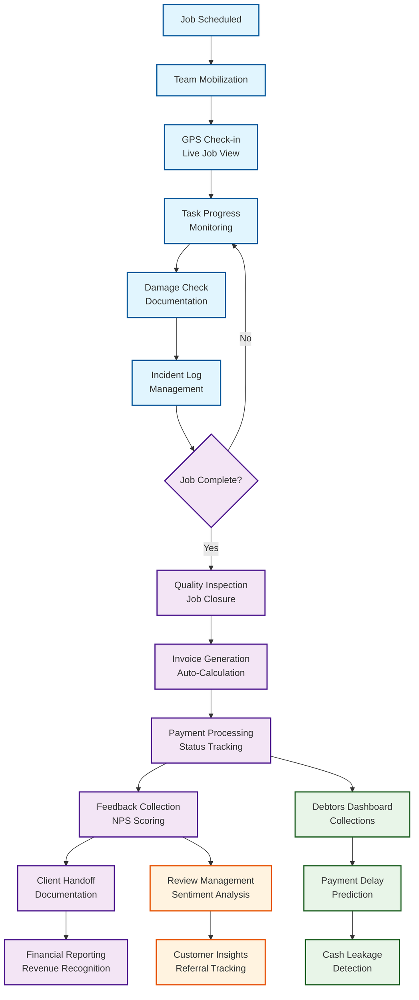

# ON-SITE EXECUTION → POST-JOB PAYMENT & DOCUMENTATION FLOW

## Complete Process Flow Diagram



## Detailed Process Breakdown

### 🔵 **ON-SITE EXECUTION PHASE**

#### 1. **Live Job View** (`/admin/jobs/live-job-view`)
- **GPS Check-in**: Team members check-in with location coordinates
- **Real-time Tracking**: Supervisor monitors team locations (±2m-6m accuracy)
- **Progress Monitoring**: Task-by-task completion tracking
- **Time Management**: Elapsed vs. remaining time calculations

#### 2. **Task Progress** (`/admin/jobs/task-progress`)
- **Live Updates**: Supervisor messaging and milestone tracking
- **Status Indicators**: Started → In Progress → Completed
- **Time Logging**: Automatic duration calculation
- **Team Assignment**: Individual task assignments

#### 3. **Damage Check** (`/admin/jobs/damage-check`)
- **Photo Documentation**: Timestamped, GPS-tagged photos
- **Severity Classification**: High/Medium/Low priority
- **Responsibility Assignment**: Client/Facility/Unknown
- **Cost Estimation**: Damage repair estimates

#### 4. **Incident Log** (`/admin/jobs/incident-log`)
- **Issue Escalation**: Emergency/Immediate/Standard priority
- **Cost Tracking**: Incident resolution expenses
- **Action Timeline**: Responsible party assignments
- **Resolution Documentation**: Follow-up actions

---

### 🟣 **POST-JOB PAYMENT & DOCUMENTATION PHASE**

#### 5. **Job Closure** (`/admin/jobs/job-closure`)
- **Quality Inspection**: Pass/fail with detailed notes
- **Invoice Generation**: Auto-calculated with cost breakdown
- **Client Handoff**: Professional documentation
- **Payment Status**: Pending → Paid tracking

#### 6. **Invoice Generator** (`/admin/finance/invoice-generator`)
- **Auto-Generation**: System creates invoices on job completion
- **VAT Compliance**: Configurable rates (0%-15%)
- **Line Items**: Detailed cost breakdown
- **Payment Tracking**: Status management (Draft → Sent → Paid)

#### 7. **Payment Tracker** (`/admin/finance/payment-tracker`)
- **Payment Processing**: Multiple payment methods
- **Status Monitoring**: Real-time payment updates
- **Outstanding Balance**: Automatic calculations
- **Payment History**: Complete transaction logs

#### 8. **Feedback Collection** (`/admin/jobs/feedback-collection`)
- **NPS Scoring**: 0-10 scale customer satisfaction
- **AI Sentiment Analysis**: Automated feedback processing
- **Review Management**: Customer testimonials
- **Quality Scoring**: Service performance metrics

---

### 🟢 **FINANCIAL MANAGEMENT PHASE**

#### 9. **Debtors Dashboard** (`/admin/finance/debtors-dashboard`)
- **Collections Management**: Outstanding payment tracking
- **Risk Assessment**: Payment delay prediction
- **Cash Flow Monitoring**: Revenue recognition
- **Collections Strategy**: Automated follow-ups

#### 10. **Finance Reports** (`/admin/finance/finance-reports`)
- **Revenue Analytics**: Monthly/quarterly reporting
- **Cash Leakage Detection**: Financial loss prevention
- **VAT Reporting**: Tax compliance documentation
- **Profitability Analysis**: Service line performance

---

### 🟠 **CUSTOMER EXPERIENCE PHASE**

#### 11. **Customer Insights** (`/admin/jobs/customer-insights`)
- **Satisfaction Tracking**: Long-term customer metrics
- **Referral Management**: Word-of-mouth tracking
- **Service Quality**: Performance benchmarking
- **Relationship Building**: Customer lifetime value

---

## Key Integration Points

### **Real-time Data Flow**
```
GPS Check-in → Task Progress → Damage Documentation → Incident Logging
    ↓
Job Closure → Invoice Auto-Generation → Payment Processing
    ↓
Feedback Collection → Customer Insights → Referral Tracking
```

### **Financial Compliance**
```
Job Completion → VAT Calculation → Invoice Generation → Payment Tracking
    ↓
Debtors Management → Collections → Finance Reporting
```

### **Quality Assurance**
```
On-site Monitoring → Quality Inspection → Feedback Analysis
    ↓
Service Improvement → Customer Satisfaction → Referrals
```

---

## Process Metrics Tracked

### **Operational Metrics**
- GPS check-in accuracy (±2m-6m radius)
- Task completion time vs. estimates
- Incident response time
- Quality inspection pass rates

### **Financial Metrics**
- Invoice generation time
- Payment collection rates
- Outstanding balance aging
- Cash leakage detection

### **Customer Metrics**
- NPS scores (0-10 scale)
- Customer satisfaction ratings
- Referral generation rates
- Repeat business percentages

---

## System Architecture

### **Data Integration**
- **Real-time GPS**: Location tracking with accuracy indicators
- **Photo Metadata**: Timestamped, GPS-tagged documentation
- **Financial Compliance**: VAT calculations and tax reporting
- **AI Processing**: Sentiment analysis and delay prediction

### **Security & Compliance**
- **Audit Trails**: Complete transaction logging
- **Data Encryption**: End-to-end security
- **Regulatory Compliance**: VAT and financial reporting
- **Access Control**: Role-based permissions

This comprehensive flow ensures complete visibility from initial job scheduling through final customer satisfaction tracking, with integrated financial management and compliance documentation throughout the entire process.</content>
<parameter name="filePath">/Users/macbookpro/Desktop/homeware/ON_SITE_TO_POST_JOB_PAYMENT_FLOW.md